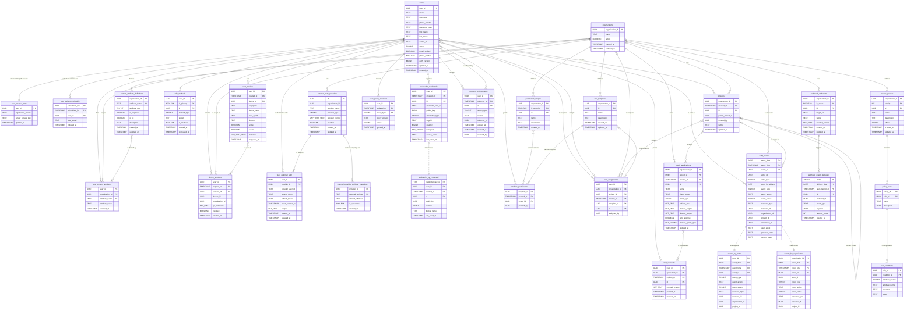

```mermaid
erDiagram
    users {
        UUID user_id PK
        TEXT email
        TEXT username
        TEXT phone_number
        TEXT password_hash
        TEXT first_name
        TEXT last_name
        TEXT avatar_url
        TINYINT status
        BOOLEAN email_verified
        BOOLEAN phone_verified
        BIGINT auth_version
        TIMESTAMP updated_at
        TIMESTAMP created_at
    }
    user_opaque_data {
        UUID user_id PK
        TEXT registration_record
        TEXT server_private_key
        TIMESTAMP updated_at
    }
    user_deletion_schedule {
        DATE scheduled_date PK
        TIMESTAMP scheduled_for PK
        UUID user_id PK
        TEXT user_email
        TIMESTAMP initiated_at
    }
    organizations {
        UUID organization_id PK
        TEXT name
        BOOLEAN active
        TIMESTAMP created_at
        TIMESTAMP updated_at
    }
    custom_attribute_definitions {
        UUID organization_id PK
        TEXT attribute_name PK
        TINYINT attribute_type
        BOOLEAN is_required
        BOOLEAN is_pii
        TEXT description
        TIMESTAMP created_at
        TIMESTAMP updated_at
    }
    user_custom_attributes {
        UUID user_id PK
        UUID organization_id PK
        TEXT attribute_name PK
        TEXT attribute_value
        TIMESTAMP updated_at
    }
    user_devices {
        UUID user_id PK
        TIMESTAMP created_at PK
        UUID device_id PK
        TEXT fingerprint
        TEXT device_name
        TEXT user_agent
        TEXT platform
        BOOLEAN active
        BOOLEAN trusted
        MAP_TEXT_TEXT metadata
        TIMESTAMP last_used_at
    }
    device_sessions {
        UUID user_id PK
        TIMESTAMP expires_at PK
        UUID session_id PK
        UUID device_id
        UUID organization_id
        SET_INET ip_addresses
        BOOLEAN revoked
        TIMESTAMP created_at
    }
    external_auth_providers {
        UUID id PK
        UUID organization_id
        TEXT provider_name
        TINYINT provider_type
        MAP_TEXT_TEXT provider_config
        BOOLEAN enabled
        TIMESTAMP created_at
        TIMESTAMP updated_at
    }
    user_external_auth {
        UUID user_id PK
        UUID provider_id PK
        TEXT provider_user_id
        TEXT access_token
        TEXT refresh_token
        TIMESTAMP token_expires_at
        SET_TEXT scopes
        TIMESTAMP created_at
        TIMESTAMP updated_at
    }
    external_provider_attribute_mappings {
        UUID provider_id PK
        TEXT external_attribute PK
        TEXT internal_attribute
        BOOLEAN is_updatable
        TIMESTAMP created_at
    }
    mfa_methods {
        UUID user_id PK
        BOOLEAN is_primary PK
        UUID id PK
        TINYINT method_type
        TEXT secret
        BOOLEAN is_enabled
        TIMESTAMP created_at
        TIMESTAMP last_used_at
    }
    webauthn_credentials {
        UUID user_id PK
        TIMESTAMP created_at PK
        UUID id PK
        TEXT credential_raw_id
        BLOB public_key
        TINYINT attestation_type
        TEXT aaguid
        BIGINT counter
        SET_TINYINT transports
        TEXT device_name
        TIMESTAMP last_used_at
    }
    webauthn_by_credential {
        TEXT credential_raw_id PK
        UUID user_id PK
        TIMESTAMP created_at PK
        UUID id PK
        BLOB public_key
        BIGINT counter
        TEXT device_name
        TIMESTAMP last_used_at
    }
    projects {
        UUID organization_id PK
        TIMESTAMP created_at PK
        UUID id PK
        UUID parent_project_id
        UUID created_by
        TEXT name
        TIMESTAMP updated_at
    }
    permission_scopes {
        UUID organization_id PK
        BOOLEAN is_sensitive PK
        UUID id PK
        TEXT name
        TEXT description
        TIMESTAMP created_at
    }
    role_templates {
        UUID organization_id PK
        UUID id PK
        TEXT name
        TEXT description
        TIMESTAMP created_at
        TIMESTAMP updated_at
    }
    template_permissions {
        UUID template_id PK
        TIMESTAMP granted_at PK
        UUID scope_id PK
        UUID granted_by
    }
    role_assignments {
        UUID user_id PK
        UUID organization_id PK
        UUID project_id PK
        TIMESTAMP expires_at PK
        UUID template_id PK
        UUID id PK
        UUID assigned_by
    }
    access_policies {
        UUID organization_id PK
        INT priority PK
        UUID id PK
        TEXT name
        TEXT description
        TINYINT effect
        TIMESTAMP created_at
        TIMESTAMP updated_at
    }
    policy_rules {
        UUID policy_id PK
        UUID rule_id PK
        TEXT name
        TEXT description
    }
    rule_conditions {
        UUID rule_id PK
        UUID condition_id PK
        TINYINT attribute_source
        TEXT attribute_name
        TEXT operator
        TEXT value
    }
    oauth_applications {
        UUID organization_id PK
        UUID project_id PK
        TIMESTAMP created_at PK
        UUID id PK
        TEXT name
        TEXT client_secret
        TINYINT client_type
        SET_TEXT redirect_uris
        SET_TEXT allowed_origins
        SET_TEXT allowed_scopes
        BOOLEAN auto_approve
        SET_TINYINT allowed_grant_types
        TIMESTAMP updated_at
    }
    user_consents {
        UUID user_id PK
        UUID application_id PK
        TIMESTAMP expires_at PK
        UUID id PK
        SET_TEXT granted_scopes
        TIMESTAMP granted_at
        TIMESTAMP revoked_at
    }
    user_policy_consents {
        UUID user_id PK
        TIMESTAMP updated_at PK
        TINYINT policy_type PK
        TEXT policy_version
        TINYINT status
        TIMESTAMP granted_at
    }
    audit_events {
        DATE event_date PK
        TIMESTAMP event_time PK
        UUID event_id PK
        UUID actor_id
        TINYINT actor_type
        INET actor_ip_address
        TINYINT event_type
        TEXT event_action
        TINYINT event_status
        TEXT resource_type
        UUID resource_id
        UUID organization_id
        UUID project_id
        UUID correlation_id
        TEXT user_agent
        TEXT previous_state
        TEXT current_state
    }
    events_by_actor {
        UUID actor_id PK
        DATE event_date PK
        TIMESTAMP event_time PK
        UUID event_id PK
        TINYINT event_type
        TEXT event_action
        TINYINT event_status
        TEXT resource_type
        UUID resource_id
        UUID organization_id
        UUID project_id
    }
    events_by_organization {
        UUID organization_id PK
        DATE event_date PK
        TIMESTAMP event_time PK
        UUID event_id PK
        UUID actor_id
        TINYINT event_type
        TEXT event_action
        TINYINT event_status
        TEXT resource_type
        UUID resource_id
        UUID project_id
    }
    webhook_endpoints {
        UUID organization_id PK
        BOOLEAN is_active PK
        UUID id PK
        TEXT target_url
        TEXT secret
        SET_TEXT enabled_events
        TIMESTAMP created_at
        TIMESTAMP updated_at
    }
    webhook_event_deliveries {
        TINYINT status PK
        DATE delivery_date PK
        TIMESTAMP last_attempt_at PK
        UUID id PK
        UUID endpoint_id
        TEXT event_type
        TEXT payload
        INT attempt_count
        TIMESTAMP created_at
    }
    account_enforcements {
        UUID user_id PK
        TIMESTAMP enforced_at PK
        UUID id PK
        TINYINT action_type
        TEXT reason
        UUID enforced_by
        TIMESTAMP expires_at
        TIMESTAMP revoked_at
        UUID revoked_by
    }

    users ||--|| user_opaque_data : "stores OPAQUE data for"
    users ||--o{ user_deletion_schedule : "schedules deletion for"
    users ||--o{ user_custom_attributes : "has"
    users ||--o{ user_devices : "has"
    users ||--o{ device_sessions : "creates"
    users ||--o{ user_external_auth : "authenticates with"
    users ||--o{ mfa_methods : "uses"
    users ||--o{ webauthn_credentials : "registers"
    users ||--o{ role_assignments : "is assigned"
    users ||--o{ user_consents : "grants"
    users ||--o{ user_policy_consents : "accepts"
    users ||--o{ account_enforcements : "targets"
    users }o--o{ audit_events : "is actor in"
    users }o--o{ projects : "creates"
    users }o--o{ template_permissions : "grants"
    users }o--o{ role_assignments : "assigns"
    users }o--o{ account_enforcements : "is enforced by"
    organizations ||--o{ custom_attribute_definitions : "defines"
    organizations ||--o{ external_auth_providers : "has"
    organizations ||--o{ projects : "has"
    organizations ||--o{ permission_scopes : "defines"
    organizations ||--o{ role_templates : "defines"
    organizations ||--o{ access_policies : "defines"
    organizations ||--o{ oauth_applications : "owns"
    organizations ||--o{ webhook_endpoints : "has"
    organizations }o--o{ audit_events : "is scope for"
    organizations }o--o{ user_custom_attributes : "scopes"
    organizations }o--o{ device_sessions : "is scope for"
    organizations }o--o{ role_assignments : "is scope for"
    custom_attribute_definitions }o--o{ user_custom_attributes : "is defined by"
    user_devices }o--o{ device_sessions : "is used in"
    external_auth_providers ||--o{ user_external_auth : "is used for"
    external_auth_providers ||--o{ external_provider_attribute_mappings : "defines mappings for"
    projects }o--o{ oauth_applications : "scopes"
    projects }o--o{ role_assignments : "scopes"
    projects }o--o{ audit_events : "is scope for"
    projects }o--|| projects : "can be child of"
    permission_scopes }o--o{ template_permissions : "is permission for"
    role_templates ||--o{ template_permissions : "has permissions"
    role_templates }o--o{ role_assignments : "is template for"
    access_policies ||--o{ policy_rules : "contains"
    policy_rules ||--o{ rule_conditions : "is composed of"
    oauth_applications }o--o{ user_consents : "is consented to"
    webhook_endpoints ||--o{ webhook_event_deliveries : "triggers"
    webauthn_credentials ||..|| webauthn_by_credential : "materializes"
    audit_events ||..|| events_by_actor : "materializes"
    audit_events ||..|| events_by_organization : "materializes"
```